# Crypto News Agent - System Architecture

This document visualizes the complete architecture and data flow of the Crypto News Agent system.

## 1. High-Level System Overview

```mermaid
flowchart LR
    USER[👤 User] --> REACT[⚛️ React<br/>Frontend]
    REACT --> API[🚀 FastAPI<br/>Backend]
    API --> SEARCH[(🔍 Hybrid<br/>Search)]
    API --> LLM[🤖 LLM<br/>Ollama/OpenAI]

    CRON[⏰ Cron] --> SCRAPER[🕷️ Scraper]
    SCRAPER --> DB[(💾 Database)]
    DB --> SEARCH

    LLM -.->|SSE Stream| REACT

    classDef frontend fill:#a29bfe,stroke:#6c5ce7,color:#fff
    classDef backend fill:#74b9ff,stroke:#0984e3,color:#fff
    classDef data fill:#95e1d3,stroke:#38a3a5,color:#000
    classDef cron fill:#ff6b6b,stroke:#c92a2a,color:#fff

    class USER,REACT frontend
    class API,LLM backend
    class SEARCH,DB data
    class CRON,SCRAPER cron
```



---

## 2. Data Ingestion Pipeline (Background)

```mermaid
flowchart TB
    CRON[⏰ Cron Job<br/>Every Minute]

    SCRAPER[🕷️ Scraper Service<br/>httpx + BeautifulSoup]

    subgraph "News Sources"
        CT[CoinTelegraph]
        TD[The Defiant]
        DL[DL News]
    end

    DB[(🗄️ SQLite<br/>news_articles.db)]

    EMBED[🧠 Embeddings<br/>sentence-transformers<br/>384-dim vectors]

    FAISS[(🔍 FAISS<br/>Vector Search)]

    BM25[(📚 BM25<br/>Keyword Search)]

    CRON --> SCRAPER
    SCRAPER --> CT
    SCRAPER --> TD
    SCRAPER --> DL
    CT --> DB
    TD --> DB
    DL --> DB
    DB --> EMBED
    EMBED --> FAISS
    EMBED --> BM25

    classDef cron fill:#ff6b6b,stroke:#c92a2a,color:#fff
    classDef scraper fill:#4ecdc4,stroke:#0a9396,color:#fff
    classDef db fill:#95e1d3,stroke:#38a3a5,color:#000
    classDef vector fill:#6c5ce7,stroke:#5f3dc4,color:#fff

    class CRON cron
    class SCRAPER,CT,TD,DL scraper
    class DB db
    class EMBED,FAISS,BM25 vector
```



---

## 3. User Query Flow (Real-time)

```mermaid
flowchart TB
    USER[👤 User Query]
    REACT[⚛️ React Frontend]
    API[🚀 FastAPI]

    MOD[🛡️ Moderation<br/>Detoxify]

    SEARCH[🔎 Hybrid Search<br/>70% Semantic + 30% Keyword]

    FAISS[(🔍 FAISS)]
    BM25[(📚 BM25)]
    DB[(💾 SQLite)]

    LLM[🤖 LLM Service<br/>LangChain]

    OLLAMA[🦙 Ollama<br/>Local]
    OPENAI[🔑 OpenAI<br/>Cloud]

    USER --> REACT
    REACT -->|POST /api/ask| API
    API --> MOD
    MOD -->|✓ Safe| SEARCH
    SEARCH --> FAISS
    SEARCH --> BM25
    SEARCH --> DB
    SEARCH -->|Top 5 Articles| LLM
    LLM --> OLLAMA
    LLM --> OPENAI
    LLM -->|SSE Stream| API
    API -->|text/event-stream| REACT
    REACT --> USER

    classDef frontend fill:#a29bfe,stroke:#6c5ce7,color:#fff
    classDef backend fill:#74b9ff,stroke:#0984e3,color:#fff
    classDef data fill:#95e1d3,stroke:#38a3a5,color:#000
    classDef llm fill:#fd79a8,stroke:#e84393,color:#fff

    class USER,REACT frontend
    class API,MOD,SEARCH backend
    class FAISS,BM25,DB data
    class LLM,OLLAMA,OPENAI llm
```



---

## 4. Tech Stack


## Detailed Component Descriptions

### 🔄 Data Ingestion Pipeline (Background Process)

#### 1. **Cron Job Scheduler**

- **Purpose**: Automated periodic data refresh
- **Configuration**: Default every minute (customizable: 5min, 10min, hourly, daily)
- **Script**: `cron_refresh.sh --setup [interval]`
- **Logging**: `backend/logs/cron.log`

#### 2. **Web Scrapers**

- **Technology**: `httpx` (async HTTP) + `BeautifulSoup` (HTML parsing)
- **Sources**:
  - CoinTelegraph: `https://cointelegraph.com`
  - The Defiant: `https://thedefiant.io`
  - DL News: `https://dlnews.com`
- **Features**:
  - Parallel async fetching for speed
  - User-Agent headers to bypass bot detection
  - Deduplication via URL checking
  - Rate limiting and error handling

#### 3. **SQLite Database**

- **File**: `news_articles.db`
- **Schema**:
  - `id`: Primary key
  - `title`, `content`, `url`: Article data
  - `source`: Publisher name
  - `published_date`: Original publish date
  - `scraped_at`: When we fetched it
  - `created_at`: When added to DB
- **Purpose**: Persistent storage, metadata queries, date filtering

#### 4. **Embedding Service**

- **Model**: `sentence-transformers/all-MiniLM-L6-v2`
- **Dimensions**: 384
- **Process**:
  - Combines `title + content` for each article
  - Generates dense vector embeddings
  - Batch processing for efficiency
- **Output**: NumPy arrays for FAISS indexing

#### 5. **FAISS Vector Database**

- **Index Type**: `IndexFlatL2` (L2 distance)
- **File**: `data/faiss.index`
- **Purpose**: Semantic similarity search
- **Scoring**: `1 / (1 + L2_distance)` → 0-1 similarity score
- **Performance**: Sub-millisecond search for thousands of vectors

#### 6. **BM25 Keyword Index**

- **Algorithm**: `BM25Okapi` (rank-bm25)
- **File**: `data/bm25.pkl`
- **Tokenization**:
  - Handles brand names (e.g., "pump.fun" vs "pumpfun")
  - Domain-aware (preserves dots)
  - Normalization for variants
- **Purpose**: Exact keyword matching for entities, protocols, tickers

---

### ⚡ User Query Pipeline (Real-time)

#### 1. **React Frontend**

- **Framework**: React 18 + Vite
- **Features**:
  - SSE (Server-Sent Events) parsing
  - Real-time streaming UI updates
  - Session management (sessionStorage)
  - Source cards with citations
  - Loading indicators and error handling
- **Key Files**:
  - `App.jsx`: Main chat interface
  - `services/api.js`: SSE client with EventSource
  - `components/ChatMessage.jsx`: Message rendering

#### 2. **FastAPI Backend**

- **Port**: 8000
- **Key Endpoints**:
  - `POST /api/ask`: Main query endpoint
  - `GET /api/health`: Health check + LLM provider info
  - `POST /api/rebuild-index`: Manual index rebuild
  - `DELETE /api/session/{id}`: Clear chat history
  - `GET /api/index-stats`: Database statistics
- **Response Format**: SSE (text/event-stream)
  ```
  data: {"sources": [...]}
  data: {"content": "chunk"}
  data: {"content": "chunk"}
  data: [DONE]
  ```

#### 3. **Session Manager**

- **Storage**: In-memory Python dictionary
- **TTL**: 60 minutes auto-expiration
- **Purpose**: Chat history for contextual conversations
- **Session ID**: Generated client-side, passed via `X-Session-Id` header
- **Cleanup**: Periodic background task removes expired sessions

#### 4. **Moderation Service**

- **Model**: Detoxify (transformers-based)
- **Checks**:
  - Toxicity
  - Severe toxicity
  - Obscenity
  - Threats
  - Insults
  - Identity attacks
- **Threshold**: 0.7 (70% confidence)
- **Action**: HTTP 400 if unsafe content detected

#### 5. **Hybrid Search Service**

- **Weighting**: 70% semantic + 30% keyword (configurable)
- **Process**:
  1. Generate query embedding
  2. FAISS semantic search (top 4×K candidates)
  3. BM25 keyword scoring
  4. Combine scores: `(1-α)·semantic + α·keyword`
  5. Apply date filters (optional: last 30 days)
  6. Sort by hybrid score
  7. Return top-K articles
- **Threshold**: 0.25 minimum score
- **Dynamic Reloading**: Checks file modification times before each search

#### 6. **LLM Service**

- **Abstraction**: Single interface for multiple providers
- **Auto-Detection**:
  1. Check Ollama health (GET `/api/tags`)
  2. If Ollama running → use Ollama
  3. Else if OpenAI key → use OpenAI
  4. Else → error with setup instructions
- **Streaming**: Uses LangChain's `astream()` for token-by-token responses

#### 7. **LangChain Integration**

- **Purpose**: Unified LLM interface with streaming
- **Classes**:
  - `ChatOllama`: Local LLM integration
  - `ChatOpenAI`: Cloud API integration
- **Message Types**:
  - `SystemMessage`: Instructions (citation format, rules)
  - `HumanMessage`: User questions + article context
  - `AIMessage`: Previous assistant responses (chat history)
- **Streaming**: Async generator pattern (`async for chunk in llm.astream(...)`)

#### 8. **LLM Providers**

**Ollama (Local, Free)**

- **Model**: `llama3.1:8b` (default), `qwen2.5:14b`, `llama3.2:3b`
- **Base URL**: `http://localhost:11434`
- **Temperature**: 0.1 (focused responses)
- **Max Tokens**: 1000
- **Pros**: Free, private, low latency
- **Cons**: Requires 8GB+ RAM, GPU optional

**OpenAI (Cloud, Paid)**

- **Model**: `gpt-4o-mini`
- **Temperature**: 0.5
- **Max Tokens**: 800
- **Pros**: High quality, no local resources
- **Cons**: API costs, network latency

---

### 🔄 Dynamic Index Reloading

**Problem**: Cron updates indexes while server is running

**Solution**: File modification time checking

1. Track `st_mtime` of `faiss.index`, `bm25.pkl`, `article_ids.pkl`
2. Before each search, compare current `st_mtime` vs last load time
3. If indexes are newer → reload automatically
4. **No server restart required!**

---

## Data Flow Example

### Query: "What's the latest Bitcoin news?"

1. **User** types question in React UI
2. **React** sends `POST /api/ask` with `X-Session-Id` header
3. **FastAPI** receives request, checks session for chat history
4. **Moderation** checks for toxic content (passes ✓)
5. **Search**:
   - Checks if indexes updated (no reload needed)
   - Generates embedding for query → `[0.12, -0.34, ...]`
   - FAISS search: Returns 20 candidates with L2 distances
   - BM25 search: Scores all articles for keyword "bitcoin"
   - Combines scores: `0.7×semantic + 0.3×keyword`
   - Filters by date (last 30 days)
   - Returns top 5 articles with hybrid scores
6. **LLM**:
   - Builds context with 5 articles (titles, content, URLs)
   - Creates message list: `[SystemMessage, ...ChatHistory, HumanMessage]`
   - Sends to LangChain → Ollama/OpenAI
   - Receives streaming tokens: `"According"`, `" to"`, `" [Article"`, `" 1]"`, ...
7. **FastAPI** streams as SSE:
   ```
   data: {"sources": [{"id":1,"title":"Bitcoin Reaches $70K",...}]}
   data: {"content": "According to"}
   data: {"content": " [Article 1]"}
   ...
   data: [DONE]
   ```
8. **React** parses SSE events:
   - Shows source cards
   - Appends content chunks to UI in real-time
   - Displays complete answer with citations
9. **Session Manager** saves user question + assistant response for context

---

## Key Technologies

### Backend

- **FastAPI**: Modern async web framework
- **SQLAlchemy**: ORM for SQLite
- **FAISS**: Facebook's vector search library
- **rank-bm25**: Python BM25 implementation
- **sentence-transformers**: Embedding models
- **LangChain**: LLM framework
- **Detoxify**: Content moderation
- **httpx**: Async HTTP client
- **BeautifulSoup**: HTML parsing

### Frontend

- **React 18**: UI library
- **Vite**: Build tool
- **EventSource**: SSE client (native browser API)
- **Modern CSS**: Custom styling (no framework)

### Infrastructure

- **Python 3.9+**: Backend runtime
- **Node.js 18+**: Frontend build
- **Cron**: Task scheduling
- **SQLite**: Database
- **Ollama**: Local LLM runtime (optional)
- **OpenAI API**: Cloud LLM (optional)

---

## Performance Characteristics

- **Database Query**: ~50-100ms
- **FAISS Search**: ~10-50ms (thousands of vectors)
- **BM25 Search**: ~20-100ms
- **Embedding Generation**: ~100-200ms per query
- **LLM Streaming**:
  - Ollama: 10-50 tokens/sec (model dependent)
  - OpenAI: 30-100 tokens/sec
- **Total Latency (first token)**: ~500-1000ms
- **Scraping**: 2-3 sec per article
- **Initial Ingestion**: 5-10 min (30 articles × 3 sources)

---

## Deployment Considerations

### Current (MVP)

- Single server
- In-memory sessions (lost on restart)
- SQLite database
- Local file storage for indexes

### Production Recommendations

- **Sessions**: Redis with TTL
- **Database**: PostgreSQL for concurrent writes
- **Indexes**: Shared storage (S3/GCS) or Weaviate/Pinecone
- **Load Balancer**: Nginx for multiple FastAPI instances
- **Monitoring**: Prometheus + Grafana
- **Caching**: Redis for frequently accessed articles
- **CDN**: CloudFlare for frontend assets
- **Logging**: ELK stack or Datadog

---

## Security Features

1. **Content Moderation**: Detoxify prevents toxic queries
2. **Rate Limiting**: Can add middleware (not currently implemented)
3. **CORS**: Configured for local development
4. **Input Validation**: Pydantic schemas
5. **Error Handling**: Try-catch with safe error messages
6. **Session Isolation**: Unique IDs prevent cross-talk
7. **LLM Prompts**: System message prevents hallucination
