# System Architecture

High-level overview of the Crypto News Agent's technical design and data flows.

---

## System Overview

```mermaid
flowchart LR
    USER[👤 User] --> REACT[⚛️ React]
    REACT --> API[🚀 FastAPI]
    API --> SEARCH[(🔍 Hybrid<br/>Search)]
    API --> LLM[🤖 LLM]

    CRON[⏰ Cron] --> SCRAPER[🕷️ Scraper]
    SCRAPER --> DB[(💾 SQLite)]
    DB --> SEARCH

    LLM -.->|SSE Stream| REACT
```



**Two Pipelines:**

1. **Background**: Cron → Scraper → Database → Search Indexes
2. **Real-time**: User → Query → Hybrid Search → LLM → Streaming Response

---

## Data Ingestion (Background)

```mermaid
flowchart TB
    CRON[⏰ Cron Job] --> SCRAPER[🕷️ Scraper]

    subgraph "Sources"
        CT[CoinTelegraph]
        TD[The Defiant]
        DL[DL News]
    end

    SCRAPER --> CT & TD & DL
    CT & TD & DL --> DB[(💾 SQLite)]
    DB --> EMBED[🧠 Embeddings]
    EMBED --> FAISS[(FAISS)] & BM25[(BM25)]
```



**Components:**

- **Cron**: Configurable scheduling (1min/5min/hourly/daily)
- **Scraper**: `httpx` + `BeautifulSoup` with User-Agent headers, parallel fetching
- **Database**: SQLite with article metadata (title, content, URL, dates)
- **Embeddings**: `all-MiniLM-L6-v2` (384-dim vectors, ~50MB model)
- **FAISS**: Vector similarity search (L2 distance)
- **BM25**: Keyword matching index (handles brand names, exact terms)

---

## User Query Flow (Real-time)

```mermaid
flowchart TB
    USER[👤 Query] --> API[🚀 FastAPI]
    API --> MOD[🛡️ Moderation]
    MOD --> SEARCH[🔎 Hybrid Search]
    SEARCH --> FAISS & BM25 & DB
    SEARCH --> LLM[🤖 LLM]
    LLM --> OLLAMA[Ollama] & OPENAI[OpenAI]
    LLM -.->|SSE| USER
```



**Pipeline Steps:**

1. **Moderation**: Transformers pipeline (unitary/toxic-bert) checks for toxic/inappropriate content (threshold: 0.5)
2. **Hybrid Search**:
   - Generate query embedding (384-dim)
   - FAISS semantic search (70% weight)
   - BM25 keyword search (30% weight)
   - Combine scores, filter by date, return top-K
3. **LLM Context**: Build prompt with retrieved articles + chat history
4. **Stream Response**: Token-by-token via Server-Sent Events

---

## Tech Stack

| Layer          | Technology                                 |
| -------------- | ------------------------------------------ |
| **Frontend**   | React 18, Vite, Server-Sent Events         |
| **Backend**    | FastAPI, SQLAlchemy, LangChain             |
| **Search**     | FAISS (semantic), BM25 (keyword)           |
| **Embeddings** | sentence-transformers (all-MiniLM-L6-v2)   |
| **LLM**        | Ollama (local) or OpenAI (cloud)           |
| **Moderation** | transformers pipeline (unitary/toxic-bert) |
| **Scraping**   | httpx, BeautifulSoup                       |
| **Database**   | SQLite                                     |
| **Scheduling** | Cron                                       |

---

## Key Features

### Hybrid Search

- **Problem**: Pure semantic search fails on brand names ("pump.fun"), specific entities, exact phrases
- **Solution**: Combine semantic (meaning) + keyword (exact match)
- **Weights**: 70% semantic / 30% keyword (configurable via `keyword_boost`)
- **Result**: Higher relevance for entity-specific queries

### Dynamic Index Reloading

- **Problem**: Cron updates indexes while server runs
- **Solution**: Check file modification times before each search
- **Benefit**: No server restart needed for new articles

### LLM Provider Auto-Detection

1. Check if Ollama running (GET `http://localhost:11434/api/tags`)
2. If yes → use Ollama (free, local)
3. If no → check for OpenAI API key
4. If yes → use OpenAI (paid, cloud)
5. If neither → error with setup instructions

### Session Management

- **Storage**: In-memory dictionary (MVP)
- **TTL**: 60 minutes auto-expiration
- **Purpose**: Chat history for contextual follow-up questions
- **Header**: `X-Session-Id` for session tracking

---

## Data Flow Example

**Query:** "What's the latest Bitcoin news?"

1. React sends `POST /api/ask` with session ID
2. FastAPI checks session for chat history
3. Moderation validates query (passes ✓)
4. Search service:
   - Checks if indexes updated (auto-reload if needed)
   - Generates query embedding
   - FAISS returns 20 candidates with L2 distances
   - BM25 scores all articles for "bitcoin"
   - Combines: `0.7×semantic + 0.3×keyword`
   - Filters last 30 days, returns top 5
5. LLM builds context with articles + chat history
6. Streams tokens via SSE:
   ```
   data: {"sources": [...]}
   data: {"content": "According to"}
   data: {"content": " [Article 1]"}
   data: [DONE]
   ```
7. React displays sources + streaming response
8. Session stores conversation for follow-ups

---

## Architecture Decisions

See [reflection.md](./reflection.md) for detailed discussion of MVP choices, trade-offs, and future improvements.
