# System Architecture

High-level overview of the Crypto News Agent's technical design and data flows.

---

## System Overview

```mermaid
flowchart LR
    USER[👤 User] --> REACT[⚛️ React]
    REACT --> API[🚀 FastAPI]
    API --> AGENT[🤖 RAG Agent]
    AGENT --> SEARCH[(🔍 Search)]
    AGENT --> LLM[🤖 LLM]

    CRON[⏰ Cron] --> SCRAPER[🕷️ Scraper]
    SCRAPER --> DB[(💾 SQLite)]
    DB --> SEARCH

    LLM -.->|SSE Stream| REACT
```



**Two Pipelines:**

1. **Background**: Cron → Scraper → Database → Search Indexes
2. **Real-time**: User → Query → **RAG Agent** → (Search if needed) → LLM → Streaming Response

---

## Data Ingestion (Background)

```mermaid
flowchart TB
    CRON[⏰ Cron Job] --> SCRAPER[🕷️ Scraper]

    subgraph "Sources"
        CT[CoinTelegraph]
        TD[The Defiant]
        DL[DL News]
    end

    SCRAPER --> CT & TD & DL
    CT & TD & DL --> DB[(💾 SQLite)]
    DB --> EMBED[🧠 Embeddings]
    EMBED --> QDRANT[(Qdrant)]
```



**Components:**

- **Cron**: Configurable scheduling (1min/5min/hourly/daily)
- **Scraper**: `httpx` + `BeautifulSoup` with User-Agent headers, parallel fetching
- **Database**: SQLite with article metadata (title, content, URL, dates)
- **Embeddings**: `all-mpnet-base-v2` (768-dim vectors, better quality than previous 384-dim model)
- **Qdrant**: Vector similarity search with hybrid search (dense + sparse vectors)

**Storage Architecture:**

- **SQLite** (`backend/news_articles.db`): Article metadata and content
- **Qdrant** (`qdrant-storage/`): Vector embeddings + metadata in single unified storage
  - Dense vectors (semantic embeddings, 768-dim)
  - Sparse vectors (BM25 keyword matching for hybrid search)
  - Article metadata (ID, title, source, URL, dates) stored as payload
  - No separate mapping files needed - Qdrant stores everything
  - Created automatically when Docker container starts

---

## User Query Flow (Real-time) - RAG Agent Architecture

```mermaid
flowchart TB
    USER[👤 Query] --> API[🚀 FastAPI]
    API --> MOD[🛡️ Moderation]
    MOD --> AGENT[🤖 RAG Agent]

    AGENT --> DECIDE{Should Search?}
    DECIDE -->|Yes| IMPROVE[Query Improvement]
    DECIDE -->|No| HISTORY[Use Chat History]

    IMPROVE --> SEARCH[🔎 Semantic Search]
    SEARCH --> QDRANT[(Qdrant)]
    QDRANT --> ARTICLES[Article Context]

    ARTICLES --> LLM[LLM Generation]
    HISTORY --> LLM
    LLM --> OLLAMA[Ollama] & OPENAI[OpenAI]
    LLM -.->|SSE Stream| USER

    AGENT --> SESSION[💾 Session Manager]
    SESSION --> HISTORY
```



**RAG Agent Pipeline:**

1. **Moderation**: Transformers pipeline (unitary/toxic-bert) checks for toxic/inappropriate content
2. **Agent Decision**: Intelligent heuristic determines if search is needed:
   - Skips search for: greetings, conversation meta-questions ("what did I ask?"), follow-ups using chat history
   - Performs search for: new information queries about crypto news
3. **Query Improvement**: Expands abbreviations (BTC → Bitcoin, ETH → Ethereum) for better search
4. **Semantic Search** (if needed):
   - Hybrid search (dense + sparse embeddings)
   - Returns top-K articles with relevance scores
5. **Context Building**: Formats articles with citations for LLM
6. **LLM Generation**: Streams response prioritizing article information over general knowledge
7. **Session Storage**: Saves conversation for future context

---

## Tech Stack

| Layer          | Technology                                 |
| -------------- | ------------------------------------------ |
| **Frontend**   | React 18, Vite, Server-Sent Events         |
| **Backend**    | FastAPI, SQLAlchemy, LangChain             |
| **Search**     | Qdrant (hybrid: dense + sparse vectors)    |
| **Embeddings** | sentence-transformers (all-mpnet-base-v2)  |
| **LLM**        | Ollama (local) or OpenAI (cloud)           |
| **Moderation** | transformers pipeline (unitary/toxic-bert) |
| **Scraping**   | httpx, BeautifulSoup                       |
| **Database**   | SQLite                                     |
| **Scheduling** | Cron                                       |

---

## Design Rationale (brief)

- Model selection (embeddings): `all-mpnet-base-v2` for higher semantic recall than smaller 384-dim models while remaining CPU-friendly; balances quality and latency for news Q&A. Configurable via `EMBEDDING_MODEL`.
- LLM selection: Prefer local via Ollama (`llama3.1:8b` for balanced quality or `qwen2.5:14b` for higher quality). Falls back to OpenAI if configured. This keeps costs at zero by default and enables streaming with consistent interfaces.
- FastAPI: Async-first, excellent SSE support, and straightforward dependency injection; handles concurrent streaming requests without extra orchestration.
- LangChain: Provides unified chat/streaming interfaces and tool-friendly abstractions; we use it narrowly for LLM streaming and prompt templating without imposing heavy orchestration.
- Qdrant: Single-store for dense/sparse vectors and payload metadata, enabling hybrid search and eliminating separate mapping/index files; simple local persistence via `qdrant-storage/`.

These choices optimize for local-first development, low latency, and minimal operational overhead while keeping quality high for retrieval-augmented answers.

---

## Async concurrency and streaming

- **FastAPI async**: User endpoints (e.g., `POST /api/ask`) are `async def` and return an SSE `StreamingResponse`.
- **Parallel requests**: FastAPI/Uvicorn run requests concurrently; no extra thread pools/semaphores required.
- **LLM streaming**: Tokens stream via LangChain `astream`, forwarded to clients as SSE events.

Minimal flow:

```python
# Endpoint (simplified)
@router.post("/ask")
async def ask_question(...):
    return StreamingResponse(
        generate_sse_response(question, db, session_id, top_k),
        media_type="text/event-stream",
    )

# Agent stream (simplified)
async for chunk in llm_service.langchain_llm.astream(messages):
    if chunk.content:
        yield chunk.content
```

Concurrent test (runs in parallel automatically):

```bash
curl -N -X POST "http://localhost:8000/api/ask" -H "Content-Type: application/json" -d '{"question": "query1"}' &
curl -N -X POST "http://localhost:8000/api/ask" -H "Content-Type: application/json" -d '{"question": "query2"}' &
curl -N -X POST "http://localhost:8000/api/ask" -H "Content-Type: application/json" -d '{"question": "query3"}' &
```

Key points:

- **Use `async def` endpoints**
- **Stream with `astream` and SSE**
- **Let FastAPI manage concurrency**

---

## Key Features

### Dynamic Index Reloading

- **Problem**: Cron updates indexes while server runs
- **Solution**: Check Qdrant collection point count before each search via Qdrant API
- **Benefit**: No server restart needed for new articles, automatic index updates detected via Qdrant API
- **Architecture**: All search data (vectors, metadata, article IDs) stored in Qdrant - no separate pickle files or mapping directories

### LLM Provider Auto-Detection

1. Check if Ollama running (GET `http://localhost:11434/api/tags`)
2. If yes → use Ollama (free, local)
3. If no → check for OpenAI API key
4. If yes → use OpenAI (paid, cloud)
5. If neither → error with setup instructions

### RAG Agent Architecture

- **Agent Pattern**: The system uses an intelligent agent that decides when to search vs. when to use chat history
- **Decision Logic**: Heuristic-based rules prevent unnecessary searches:
  - Conversation questions → Use chat history
  - Greetings → Skip search, respond naturally
  - Information queries → Perform semantic search
- **Query Optimization**: Automatically improves queries (expands abbreviations) before searching
- **Article-First Responses**: System prompt prioritizes article information over general LLM knowledge
- **Smart Caching**: Avoids redundant searches when context is available in chat history

### Session Management

- **Storage**: In-memory dictionary (MVP)
- **TTL**: 60 minutes auto-expiration
- **Purpose**: Chat history for contextual follow-up questions
- **Header**: `X-Session-Id` for session tracking

### Future Agent Expansions

The current agent uses simple heuristics, but could be enhanced with:

- **LLM-Based Tool Calling**: Let the LLM decide when to search (true agent pattern)
- **Multi-Step Reasoning**: Agent could perform multiple searches iteratively
- **Query Rewriting**: Use LLM to rewrite queries based on chat history
- **Source Verification**: Agent could verify facts across multiple articles
- **Answer Confidence**: Agent could request clarification when search results are ambiguous

---

## Data Flow Example

**Query:** "What's the latest Bitcoin news?"

1. React sends `POST /api/ask` with session ID
2. FastAPI checks session for chat history
3. Moderation validates query (passes ✓)
4. **RAG Agent** decides to search (information query detected)
5. Query improvement: "Bitcoin news" → "Bitcoin cryptocurrency news"
6. Search service:
   - Checks Qdrant collection point count (auto-reloads if changed)
   - Generates query embedding (dense) + sparse embedding (BM25)
   - Qdrant hybrid search returns candidates with similarity scores
   - Retrieves article IDs from Qdrant metadata payload
   - Returns top 5 articles
7. Agent formats articles with citations and builds context
8. LLM generates response prioritizing article facts over general knowledge
9. Streams tokens via SSE:
   ```
   data: {"sources": [...]}
   data: {"content": "According to [Article 1]"}
   data: {"content": " from CoinTelegraph..."}
   data: [DONE]
   ```
10. React displays sources + streaming response
11. Session stores conversation for follow-ups

**Follow-up Query:** "what question did I just ask?"

1. RAG Agent detects conversation meta-question
2. **Skips search** (uses chat history instead)
3. Responds directly from stored conversation context

---

## Architecture Decisions

See [reflection.md](./reflection.md) for lessons learned and the future roadmap. Detailed trade-offs for non-functional requirements (cost, latency, local-first) are captured there to avoid redundancy with this document.

---

## Development Helper

### `data_reset.sh`

- Purpose: Quickly stop services and remove all local data.
- Actions:
  - Stops Qdrant (`docker compose down`).
  - Stops backend dev server (uvicorn) if running.
  - Deletes local SQLite DB (`backend/news_articles.db`).
  - Clears Qdrant storage directory (`qdrant-storage/`).
  - Starts Qdrant fresh and waits for readiness (`docker compose up -d`).
- Logging: Writes to `backend/logs/data_reset_<timestamp>.log`.
- Portability: No hardcoded paths; resolves paths relative to the script location. Paths can be overridden via environment variables:
  - `PROJECT_ROOT`, `BACKEND_DIR`, `SQLITE_DB`, `QDRANT_STORAGE`, `QDRANT_URL`.
- Intended use: Clean slate for development; ingestion can be run separately when needed.
